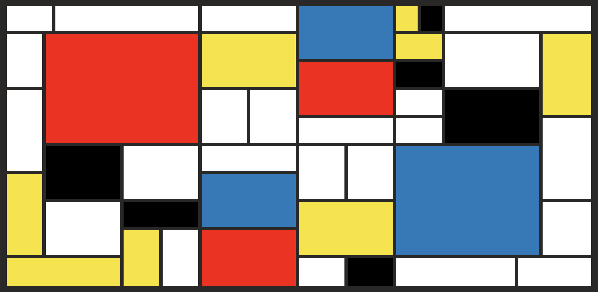

## Problem #3 - Piet Mondrian Painting

[Piet Mondrian] was a 20th century Dutch painter whose paintings emphasized simple geometric elements.

Inside a file called `index.html`, create  using HTML and flexbox.

If you're having trouble creating the whole thing, pick a "chunk" of the painting and work on just that. Then pick another "chunk" and do that, etc. How can you combine your chunks into a single image? (think: HTML tree structure).

Some students have found printing the image and numbering each rectangle helpful.

[Piet Mondrian]:https://en.wikipedia.org/wiki/Piet_Mondrian
